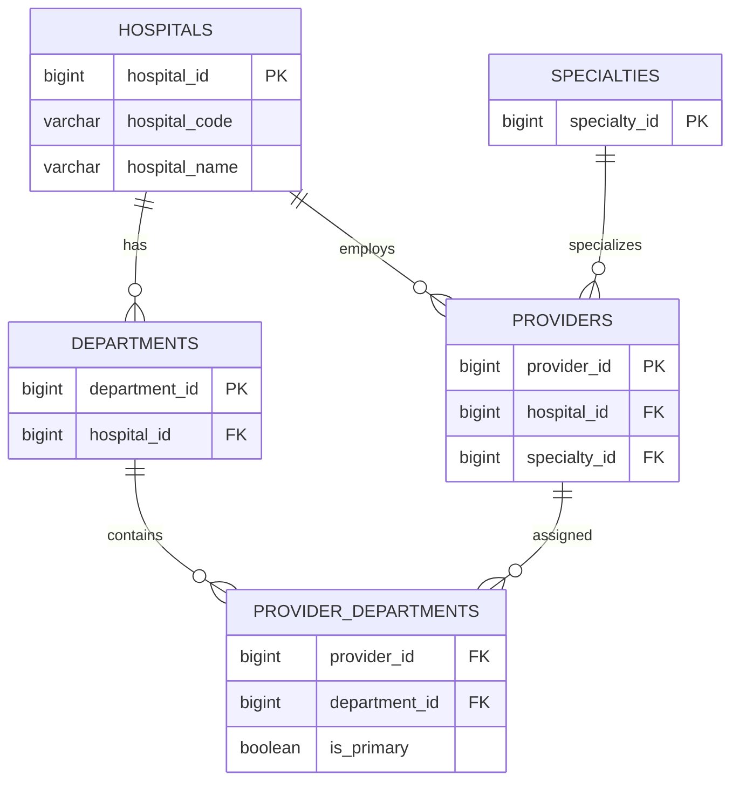

# Business Requirements Document (BRD)

## Project

Healthcare Revenue Cycle Analytics Platform

## Objective

Build an end-to-end healthcare analytics platform that ingests operational healthcare data, processes it using ETL pipelines, stores it in PostgreSQL, exposes secure REST APIs, and visualizes business KPIs through a React dashboard.

## Users

- Administrator
- Billing Staff
- Analyst

## Core Modules

- Authentication
- Patient Management
- Provider Management
- Insurance Management
- Claims Management
- Payment Management
- Analytics Dashboard
- ETL Pipeline

## KPIs

- Total Claims
- Approved Claims
- Denied Claims
- Revenue
- Payment Turnaround Time
- Denial Rate

# Entity Relationship Diagram (ERD)

## Sprint 2 - Organization Structure

```text
Hospitals
│
├── Departments
│      FK → hospital_id
│
├── Specialties
│
├── Providers
│      FK → hospital_id
│
└── Provider_Departments
       FK → provider_id
       FK → department_id
       is_primary
```

## Relationships

### Hospitals → Departments

- One Hospital can have many Departments.
- A Department belongs to exactly one Hospital.

Cardinality

```
Hospital (1) -------- (∞) Departments
```

---

### Hospitals → Providers

- One Hospital can have many Providers.
- A Provider belongs to one Hospital.

```
Hospital (1) -------- (∞) Providers
```

---

### Providers ↔ Departments

A Provider may work in multiple Departments.

Examples

- Cardiology
- Emergency
- ICU

This relationship is implemented using the Provider_Departments bridge table.

```
Providers (∞) ----- (∞) Departments
```

---

### Providers → Specialties

Each Provider has one primary Specialty.

```
Specialties (1) ------ (∞) Providers
```

## Current ER Diagram



# Specialties Design Document

## Overview

The **Specialties** table stores the master list of medical specialties used throughout the Healthcare Revenue Cycle Analytics Platform.

A specialty represents a doctor's area of medical expertise and is shared across all hospitals in the system.

Examples:

- Cardiology
- Neurology
- Orthopedics
- Pediatrics
- Oncology

This table serves as a centralized reference (master data) for assigning specialties to healthcare providers.

---

# Business Requirement

A specialty defines the medical expertise of a healthcare provider.

Examples:

| Provider | Specialty |
|----------|-----------|
| Dr. Amit Sharma | Cardiology |
| Dr. Neha Gupta | Neurology |
| Dr. Rahul Verma | Orthopedics |

A provider may work at any hospital, but the definition of a specialty remains the same across the entire organization.

---

# Design Discussion

Two possible approaches were evaluated.

---

## Option 1 — Hospital-Specific Specialties

Each hospital maintains its own specialty list.

Example:

| Hospital | Specialty |
|----------|-----------|
| Apollo Hospital | Cardiology |
| Fortis Hospital | Cardiology |
| Max Hospital | Cardiology |

### Advantages

- Hospitals manage specialties independently.

### Disadvantages

- Duplicate records across hospitals.
- Difficult to maintain.
- Complicated reporting.
- Poor data normalization.
- Inconsistent naming.

Example:

Apollo → Cardiology

Fortis → Cardiology

Max → Cardiology

Three records represent the same specialty.

---

## Option 2 — Global Master Specialties (Selected)

The system maintains one centralized list of specialties.

Example:

| Specialty Code | Specialty Name |
|---------------|----------------|
| CARD | Cardiology |
| NEUR | Neurology |
| ONCO | Oncology |

Hospitals reuse these records.

Example:

Hospital: Apollo

Provider:
- Dr. Amit Sharma → Cardiology

Hospital: Fortis

Provider:
- Dr. Raj Gupta → Cardiology

Both providers reference the same specialty.

---

# Selected Design

The project uses **Option 2 (Global Master Data)**.

Reasons:

- Eliminates duplicate data.
- Improves consistency.
- Simplifies reporting and analytics.
- Easier maintenance.
- Follows Third Normal Form (3NF).
- Common enterprise database design pattern.

---

# Relationship Model

```
Hospitals
      │
      │
Departments

Specialties
      │
      │
Providers
```

Specialties are independent of hospitals.

The relationship between hospitals and specialties is established through the **Providers** table.

---

# Table Structure

| Column | Description |
|---------|-------------|
| specialty_id | Primary key |
| specialty_code | Business identifier |
| specialty_name | Display name |
| description | Description of the specialty |
| created_at | Record creation timestamp |
| updated_at | Last update timestamp |
| created_by | Created by user |
| updated_by | Updated by user |
| is_active | Soft delete flag |

---

# Constraints

## Primary Key

```
specialty_id
```

---

## Unique Constraints

```
UNIQUE(specialty_code)

UNIQUE(specialty_name)
```

These constraints ensure:

- Every specialty code is unique.
- Every specialty name is unique.
- Duplicate specialties cannot exist.

---

# Sample Data

| Code | Specialty |
|------|-----------|
| CARD | Cardiology |
| NEUR | Neurology |
| ORTH | Orthopedics |
| ONCO | Oncology |
| PED | Pediatrics |
| DERM | Dermatology |
| RADI | Radiology |
| GAST | Gastroenterology |
| UROL | Urology |
| ENT | ENT |

---

# Future Usage

The Specialties table will be referenced by:

- Providers
- Provider Assignments
- Appointment Scheduling
- Claims
- Revenue Analytics
- Provider Performance Reports

---

# Benefits

- Centralized master data
- Improved data integrity
- Better analytics
- Easier maintenance
- Reduced redundancy
- Enterprise-ready database design