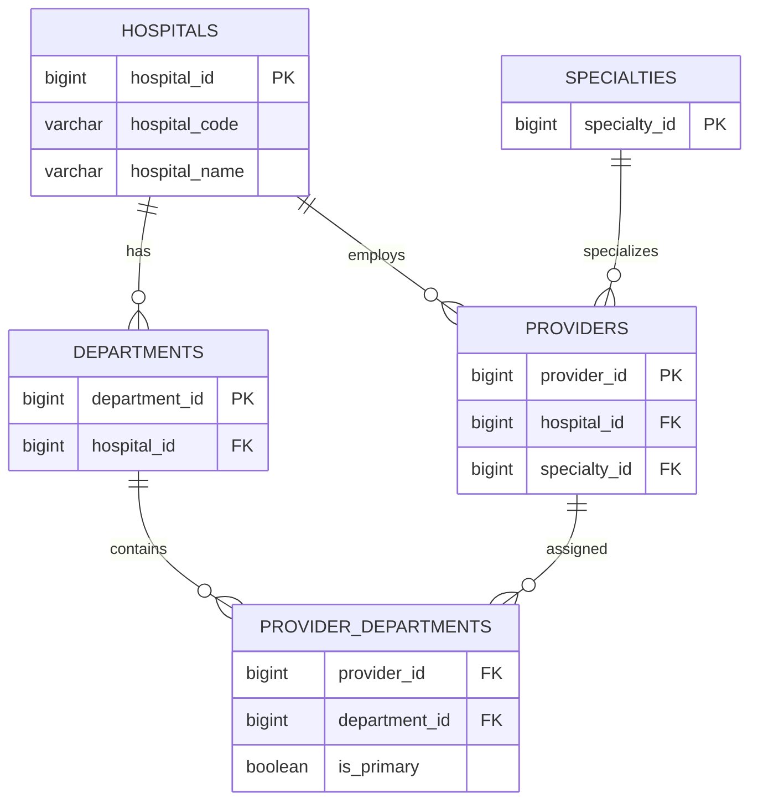

# Business Requirements Document (BRD)

## Project

Healthcare Revenue Cycle Analytics Platform

## Objective

Build an end-to-end healthcare analytics platform that ingests operational healthcare data, processes it using ETL pipelines, stores it in PostgreSQL, exposes secure REST APIs, and visualizes business KPIs through a React dashboard.

## Users

- Administrator
- Billing Staff
- Analyst

## Core Modules

- Authentication
- Patient Management
- Provider Management
- Insurance Management
- Claims Management
- Payment Management
- Analytics Dashboard
- ETL Pipeline

## KPIs

- Total Claims
- Approved Claims
- Denied Claims
- Revenue
- Payment Turnaround Time
- Denial Rate

# Entity Relationship Diagram (ERD)

## Sprint 2 - Organization Structure

```text
Hospitals
│
├── Departments
│      FK → hospital_id
│
├── Specialties
│
├── Providers
│      FK → hospital_id
│
└── Provider_Departments
       FK → provider_id
       FK → department_id
       is_primary
```

## Relationships

### Hospitals → Departments

- One Hospital can have many Departments.
- A Department belongs to exactly one Hospital.

Cardinality

```
Hospital (1) -------- (∞) Departments
```

---

### Hospitals → Providers

- One Hospital can have many Providers.
- A Provider belongs to one Hospital.

```
Hospital (1) -------- (∞) Providers
```

---

### Providers ↔ Departments

A Provider may work in multiple Departments.

Examples

- Cardiology
- Emergency
- ICU

This relationship is implemented using the Provider_Departments bridge table.

```
Providers (∞) ----- (∞) Departments
```

---

### Providers → Specialties

Each Provider has one primary Specialty.

```
Specialties (1) ------ (∞) Providers
```

## Current ER Diagram

